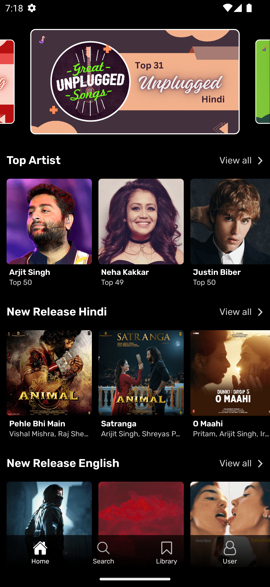
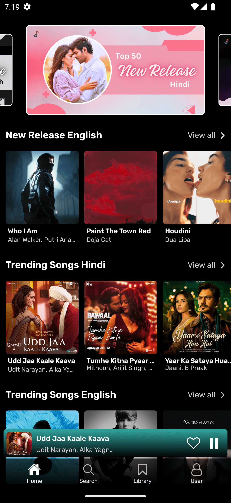
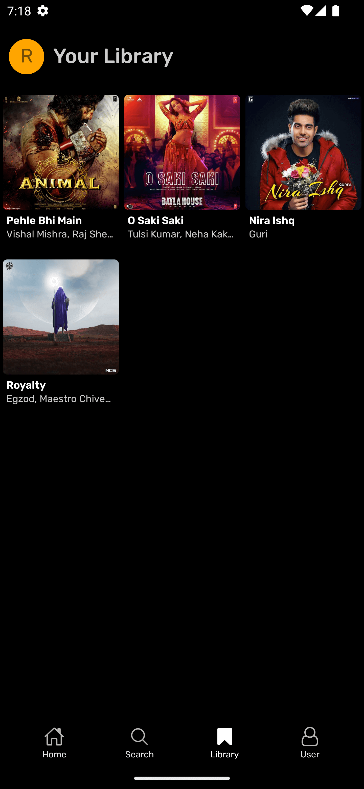
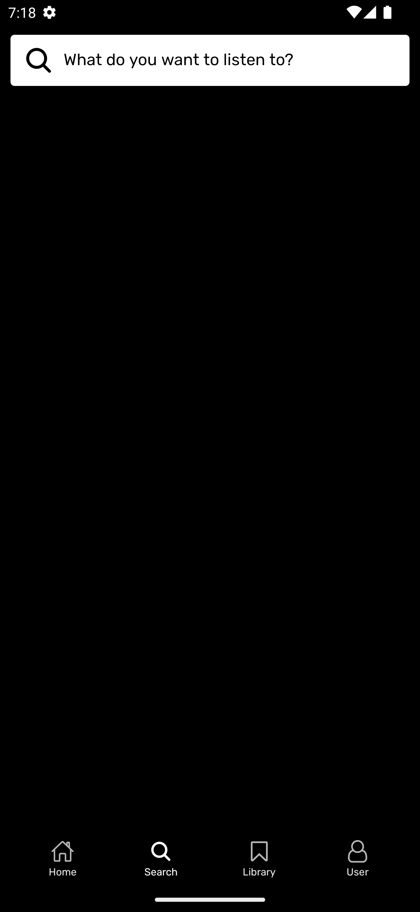
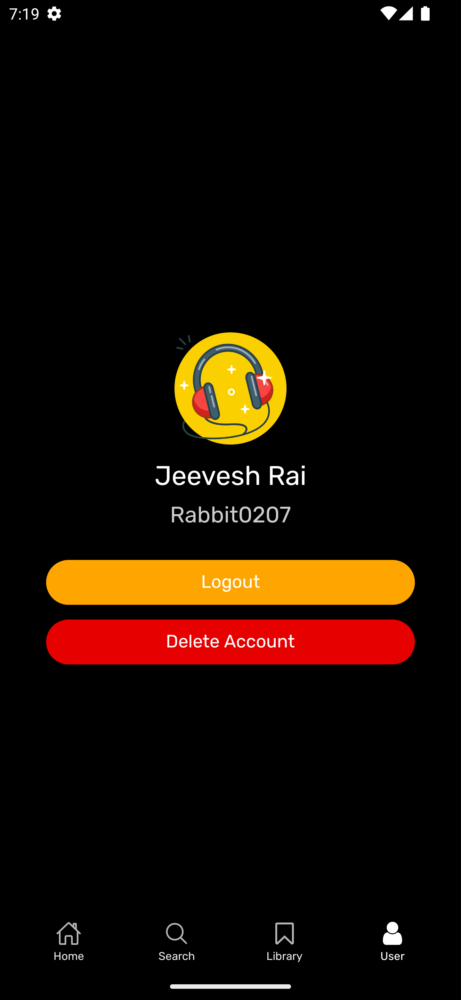

    
    <h1>Melody Music</h1>
    
Introducing Melody Music, your ultimate destination for an immersive and limitless music experience on Android! Immerse yourself in a world of unlimited tunes, seamlessly curated for your every mood and moment.

---

  
  
  

  
  
  

## 🎵 GrooveHub - Your Ultimate Music Experience 🎧
- 🆓 Totally Free
- 🎶 Unlimited Songs
- 📥 Download Tracks
- ❤️ Add to Favorites
- ⏯️ Playback Control
- 🔍 Search Any Song
- 📃 With Lyrics
- 🎶 Artist Playlists
- 🎨 Dynamic Background
- 🎉 And Many More 🚀

## Download

